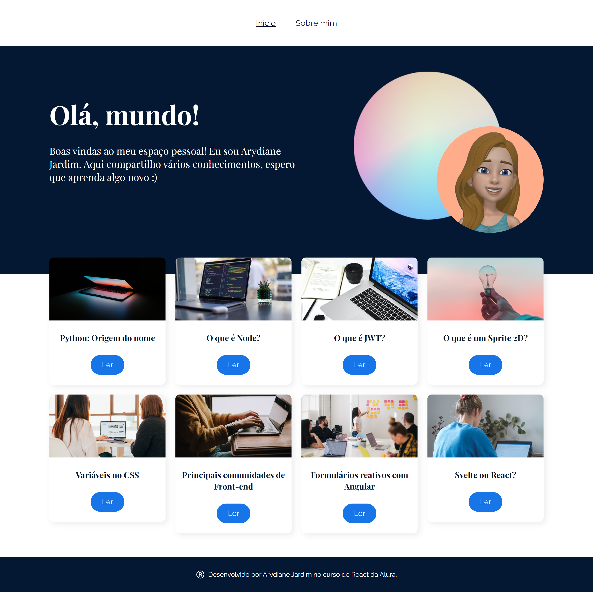

# Projeto blog Olá mundo!

A aplicação Olá mundo funciona como um blog pessoal com várias páginas onde o usuário faz postagens de artigos. E foi desenvolvido durante o curso React: desenvolvendo em React Router com JavaScript da Alura.

<strong>O objetivo do projeto é praticar os seguintes conceitos:</strong> 

- Desenvolver uma SPA (Single Page Application)
- Utilizar a biblioteca react-router-dom 
- Usar rotas aninhadas e dinâmicas
- Explorar os hooks do react-router-dom, como: useLocation e useParams
- Utilizar o CSS modules
- Absolute imports

## 💻 Layout  

O layout do figma no qual o projeto foi baseado está disponível [neste link](https://www.figma.com/file/nDTrIQxTu6aldQG0o0iAbj/Ol%C3%A1%2C-Mundo!---Projeto-React%3A-router?node-id=38%3A716)

### Web

  

 ## 🔧 Tecnologias 

As tecnologias usadas foram: 
* React
* JavaScript
* Css module

## 🛠️ Abrir e rodar o projeto
Para abrir e rodar o projeto, execute npm i para instalar as dependências e npm start para inicar o projeto.

Depois, acesse http://localhost:3000/ no seu navegador.
